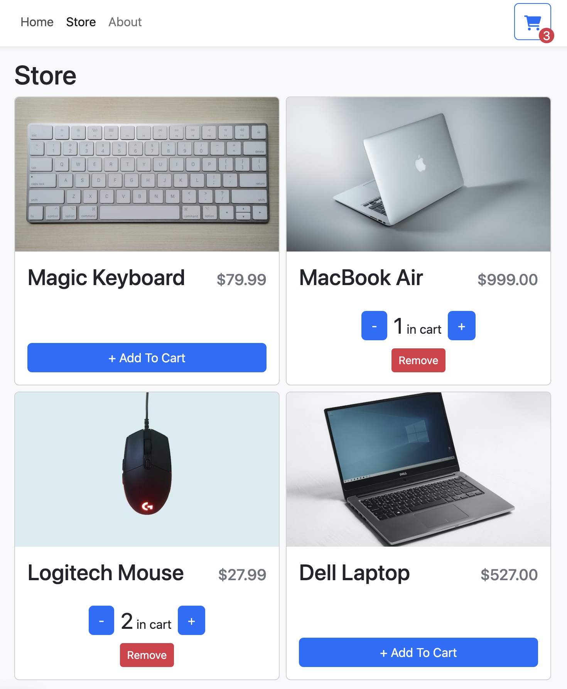
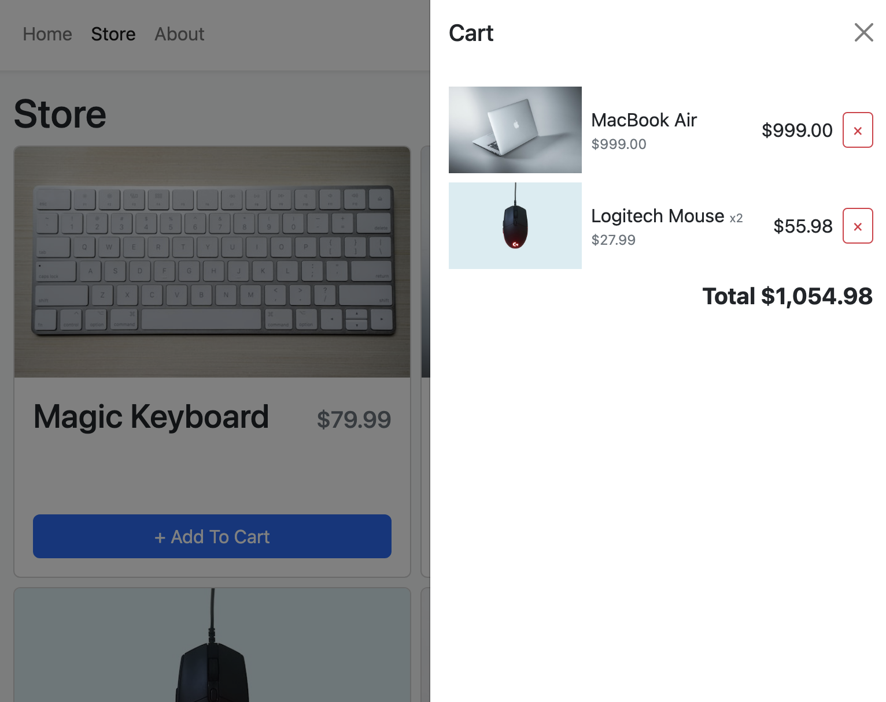

## TypeScript Shopping Cart

I created a React TypeScript shopping cart using this Web Dev Simplified [tutorial](https://www.youtube.com/watch?v=lATafp15HWA&t=2838s). Use `npm run dev` to run the app in development mode, and open http://localhost:5173/store to view it in the browser. Items can be added and removed from the cart using the `Add To Cart`, `Remove`, `+/-`, and `x` buttons. The cart toggles open and closed and includes a breakdown of the cost and quantity of each cart item. 

## Screenshots
<h4 align="center">Store</h4>

 

<h4 align="center">Cart</h4>

 

